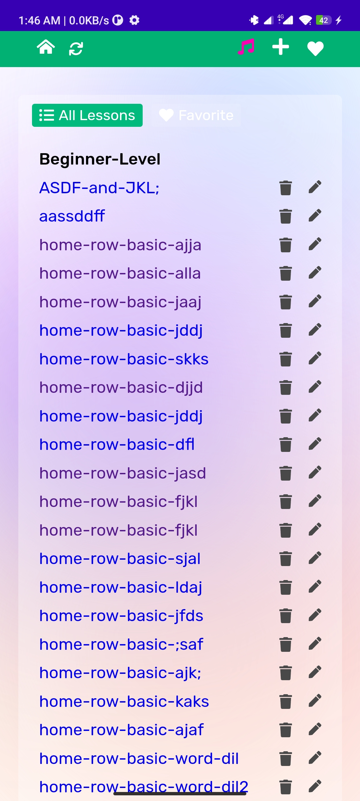
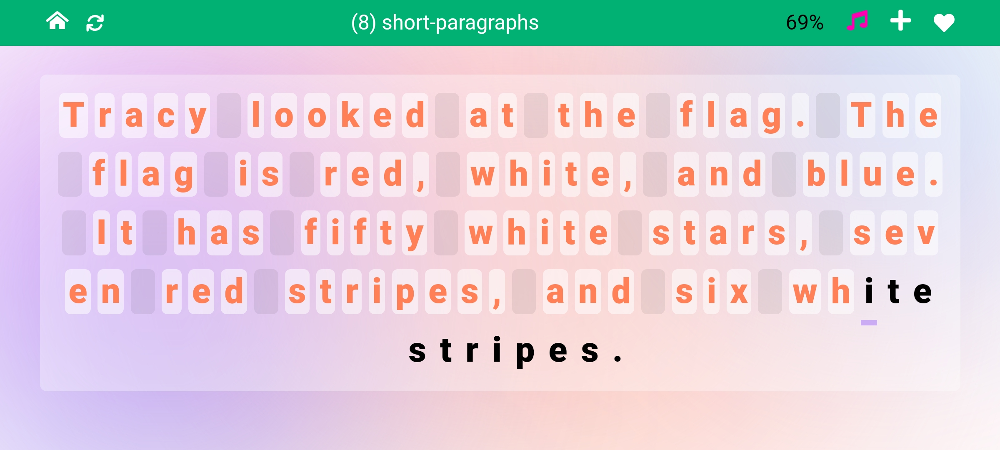
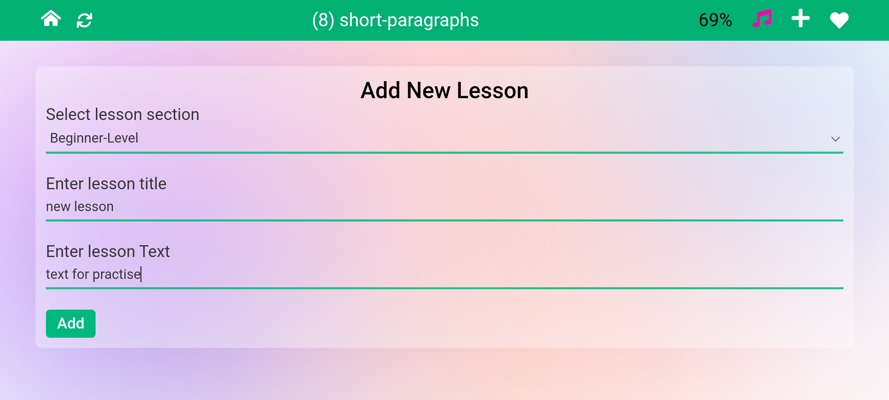
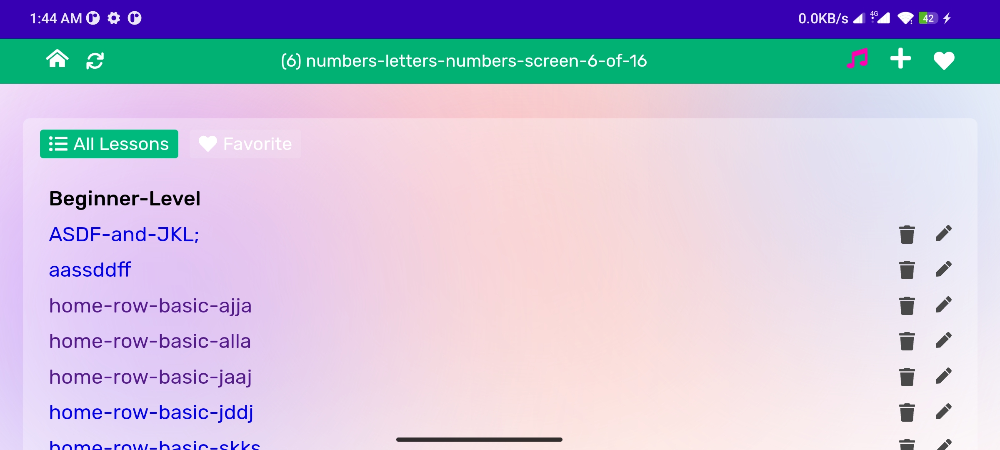
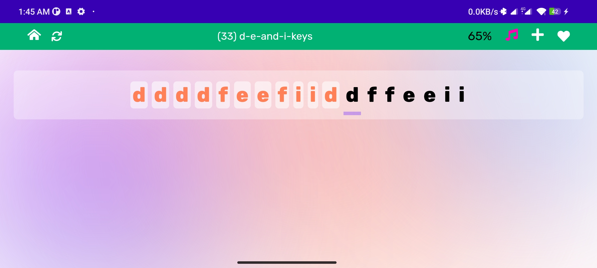
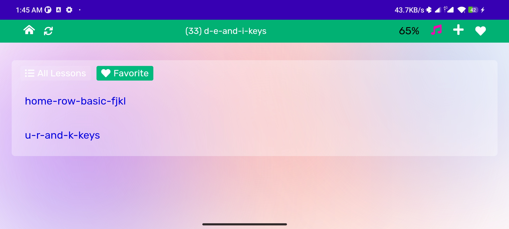
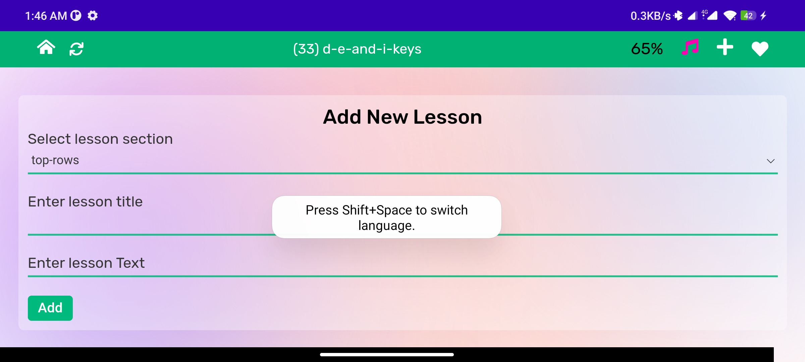
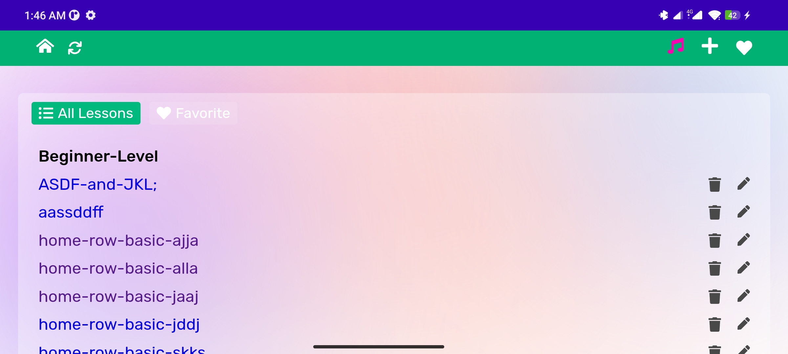
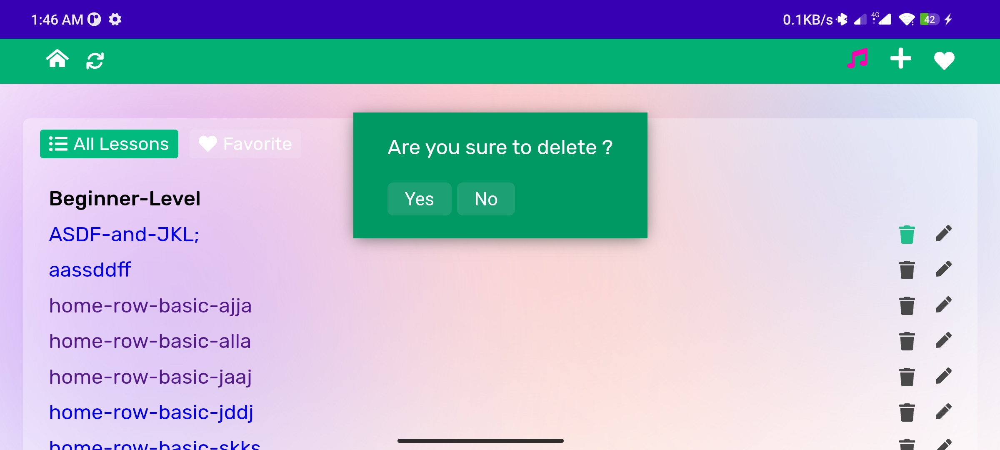
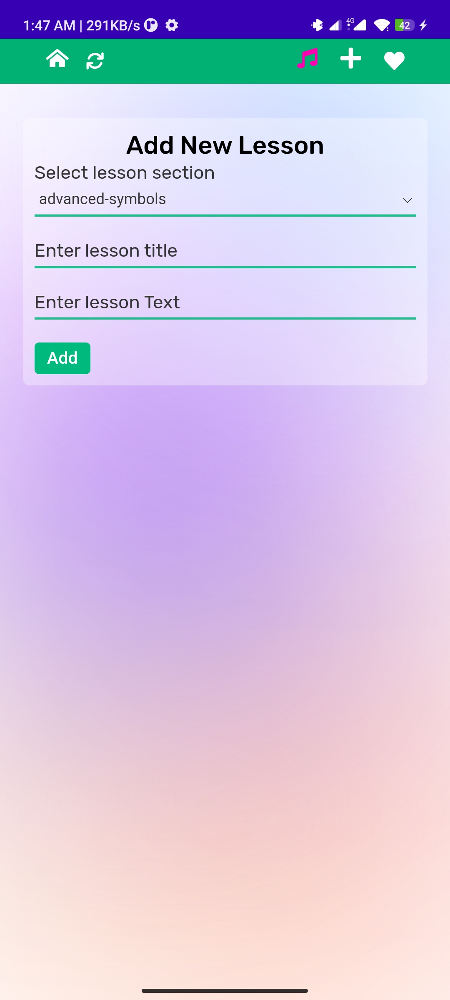

## Hello, This is my first Android project
Here I use webview with preactjs that is minimise version of Reactjs
And also I use preact-router to navigate different page.

https://user-images.githubusercontent.com/99707905/174155128-4c7fb75c-7bcc-4c11-b1a2-21fed5f0dc0b.mp4

